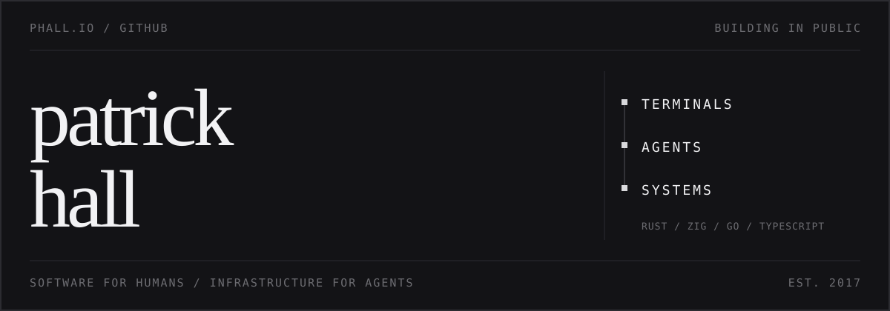

  

  <a href="https://phall.io">phall.io</a>&nbsp;&nbsp;/&nbsp;&nbsp;
  <a href="https://phall.io/writing">writing</a>&nbsp;&nbsp;/&nbsp;&nbsp;
  <a href="https://github.com/phall1?tab=repositories&type=source">all source</a>

tools for terminals, networks, and the systems beneath them.

 

| | | |
|:--|:--|:--|
| `01` | **[phux](https://github.com/phall1/phux)** | terminal control plane |
| `02` | **[token-tach](https://github.com/phall1/token-tach)** | macOS instrument for AI usage |
| `03` | **[phui](https://github.com/phall1/phui)** | GitHub, in the terminal |
| `04` | **[cyrs](https://github.com/phall1/cyrs)** | GQL compiler front-end |
| `05` | **[fella](https://github.com/phall1/fella)** | network identity and traffic containment |

<a href="https://phux.phall.io/embed">open shell -&gt;</a>

